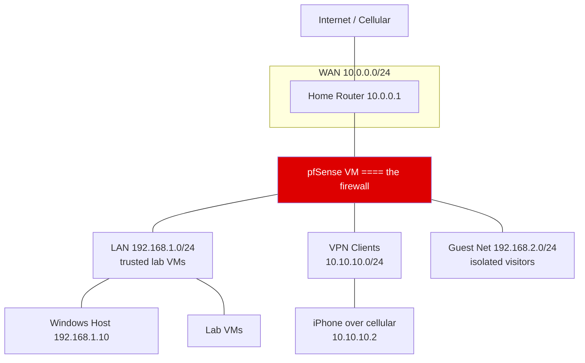

# Home Security Lab: pfSense Guest Segmentation + Suricata IDS + WireGuard VPN (Hyper-V)

A home-lab firewall build that proves three security skills:
1. **Network segmentation** — a guest network that reaches the internet but cannot touch my LAN/VMs.
2. **Intrusion detection** — Suricata watching LAN + guest traffic and alerting on scans/attacks.
3. **Secure remote access** — a WireGuard VPN so I can tunnel into the lab from anywhere.

---

## 1. Topology

- **WAN** = hn0, DHCP from home router (`10.0.0.28`)
- **LAN** = hn1, `192.168.1.0/24` (trusted)
- **Guest Net (OPT1)** = hn2, `192.168.2.0/24` (isolated)
- **WGT (OPT2)** = WireGuard tunnel, `10.10.10.0/24`
- All on separate Hyper-V virtual switches (segmentation mimicked with vSwitches instead of physical VLANs — same firewall skills)

---

## 2. What I built and why

Hypothesis-to-prove: `guests can browse the internet but must never reach my lab dev machines, and I want to (a) detect malicious activity and (b) reach my lab securely from my phone.`

**Answer: three network "rooms" carved out of one pfSense VM.**

| Interface | Purpose | Subnet |
|---|---|---|
| WAN | internet | 10.0.0.28 (DHCP) |
| LAN | trusted lab | 192.168.1.0/24 |
| Guest (OPT1) | untrusted visitors | 192.168.2.0/24 |
| WGT (OPT2) | VPN clients | 10.10.10.0/24 |

pfSense's default posture is *deny*: nothing crosses between rooms unless a firewall rule says so. Everything below is me writing those rules.

---

## 3. Configuration summary

### Guest isolation (Firewall -> Rules -> Guest Net)
Rules are evaluated top-down:

| # | Action | Protocol | Source | Destination | Port | Purpose |
|---|---|---|---|---|---|---|
| 1 | Pass | UDP | Guest subnet | firewall | 67-68 | DHCP |
| 2 | Pass | TCP/UDP | Guest subnet | firewall | 53 | DNS |
| 3 | Pass | any | Guest subnet | any | - | internet |
| 4 | Block | any | Guest subnet | 192.168.1.0/24 | - | LAN isolation |
| 5 | Block | any | Guest subnet | 10.0.0.0/24 | - | block WAN-side lab net |

Guest DHCP pool: `192.168.2.2 - .100`, with a static reservation for the guest VM (`00:15:5d:00:e9:69` -> `192.168.2.101`).

### Suricata IDS (Services -> Suricata)
- Running on **LAN** and **Guest Net** interfaces (IDS mode, alerts-only).
- Rule set: Emerging Threats OPEN (full set), daily auto-update.

### WireGuard VPN (VPN -> WireGuard)
- Tunnel `tun_wg0`: port 51820, `10.10.10.1/24`, MTU 1420.
- Peers: iPhone (`10.10.10.2`), Mac (`10.10.10.3`).
- Firewall: WGT pass rule (`10.10.10.0/24 -> any`), WAN pass UDP 51820.
- **Manual outbound NAT rule** (`10.10.10.0/24 -> WAN`) so VPN clients get internet.
- Home router: port-forward UDP 51820 -> pfSense WAN IP.

---

## 4. Proof

| Claim | Evidence |
|---|---|
| Guest can reach internet | `ping 8.8.8.8` OK from guest |
| Guest CANNOT reach LAN | `ping 192.168.1.1` -> blocked, logged in System Logs |
| Suricata detects attacks | nmap scan from guest shows ET scan alerts |
| VPN connects from cellular | iPhone "Handshake completed", internet via tunnel, pfSense Status shows peer + traffic |

---

## 5. What I learned
- **Firewall rule ordering matters** — block rules must sit before the allow-all, or segmentation silently fails.
- **NAT vs routing vs segmentation** — uploads can flow while downloads die if the outbound NAT mapping is missing.
- **A WireGuard VPN needs a route, not just a tunnel** — clients could handshake but got no reply until the interface had a static IP and pfSense owned the `10.10.10.0/24` route.
- **IDS vs IPS** — Suricata alerts first; blocking (IPS) is a tuning decision made *after* watching real alerts, to avoid false-positive lockdowns.
- **Home NAT reality** — "connect from anywhere" needs a real router port-forward + public IP (and Dynamic DNS for dynamic IPs).

---

## 6. Files
- `pfsense-setup.md` - full build notes (interfaces, DHCP, rules, Suricata, VPN, backups)
- WireGuard client config for Mac: `wg-vr-mac.conf`

---

*Build run on a Hyper-V lab, pfSense CE, Fedora guest VM, iPhone/macOS WireGuard clients.*